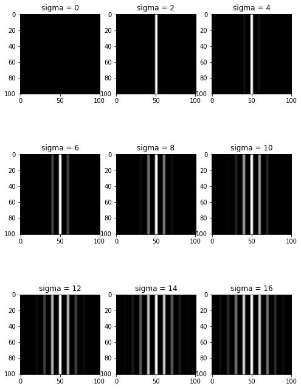
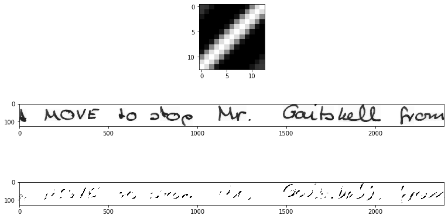
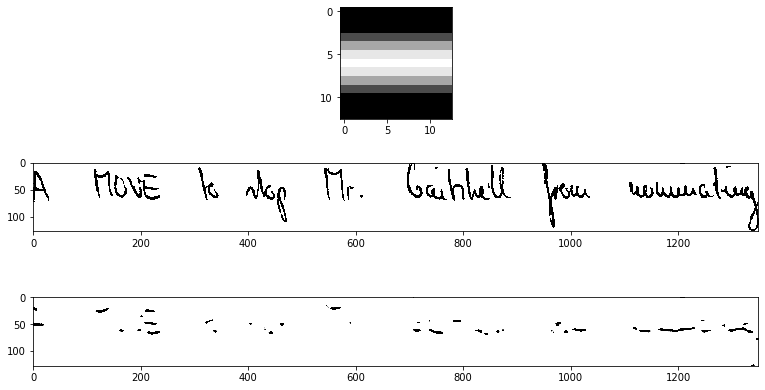
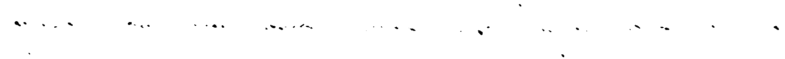

# Kernel selection

## Creating a kernel using opencv

```py
import cv2

ksize = (100,100)
sigma = 5
theta = 0*(np.pi/8)
lambd = 10
gamma = 0
phi = 0

kernel = cv2.getGaborKernel(ksize,sigma,theta,lambd,gamma,phi,ktype = cv2.CV_32F)
plt.imshow(cv2.cvtColor(kernel,cv2.COLOR_BGR2RGB))
```

## To apply a kernel on a image

```py
img = cv2.imread(img_path,0) # 0 is for reading image as grayscale
filtered_img = cv2.filter2D(img, cv2.CV_8UC3,kernel)
```

## Sample kernels

**100 x 100 kernel**

*Note : The kernel shapes are always in odd numbers even after defining shape explicitly. Hence ksize=(2,2) will return (3,3) size kernel.*

### Changing sigma



### Changing theta


### Changing lambda


### Changing gamma


### Changing phi


## Applying kernel on handwritten documents

Applying kernel on a handwritten document image.
**Kernel size = (3,3)**

```py
ksize = (3,3)
sigma = 0.01
theta = 1*(np.pi/4)
lambd = 9
gamma = 0
phi = 0
```


**Kernel size = (5,5)**

```py
ksize = (5,5)
sigma = 0.1
theta = 1*(np.pi/4)
lambd = 9
gamma = 0
phi = 0
```


**Kernel size = (7,7)**

```py
ksize = (7,7)
sigma = 0.1
theta = 1*(np.pi/4)
lambd = 9
gamma = 0
phi = 0
```


**Kernel size = (7,7) increasing sigma to 15**
increasing sigma further more doesn't improve
```py
ksize = (7,7)
sigma = 15
theta = 1*(np.pi/4)
lambd = 9
gamma = 0
phi = 0
```


**Kernel size = (9,9)**

```py
ksize = (9,9)
sigma = 5
theta = 1*(np.pi/4)
lambd = 9
gamma = 0
phi = 0
```


**Kernel size = (9,9) increasing sigma to 8**

```py
ksize = (9,9)
sigma = 8
theta = 1*(np.pi/4)
lambd = 9
gamma = 0
phi = 0
```


**Kernel size = (11,11)**

```py
ksize = (11,11)
sigma = 5
theta = 1*(np.pi/4)
lambd = 9
gamma = 0
phi = 0
```


**Kernel size = (11,11) sigma 7**

```py
ksize = (11,11)
sigma = 7
theta = 1*(np.pi/4)
lambd = 9
gamma = 0
phi = 0
```


**Kernel size = (11,11) sigma 9**

```py
ksize = (11,11)
sigma = 9
theta = 1*(np.pi/4)
lambd = 9
gamma = 0
phi = 0
```


Features are not very clear.
**Kernel size = (13,13)**

```py
ksize = (13,13)
sigma = 7
theta = 1*(np.pi/4)
lambd = 9
gamma = 0
phi = 0
```


Features are not clear. sigma should be less.
**Kernel size = (13,13) sigma 5**

```py
ksize = (13,13)
sigma = 5
theta = 1*(np.pi/4)
lambd = 9
gamma = 0
phi = 0
```


**Kernel size = (13,13) sigma 5 angle 90**

```py
ksize = (13,13)
sigma = 5
theta = 1*(np.pi/4)
lambd = 9
gamma = 0
phi = 0
```


Not good. Need to change lambda
**Kernel size = (13,13) sigma 5 angle 90 lambda=14**

```py
ksize = (13,13)
sigma = 5
theta = 1*(np.pi/4)
lambd = 14
gamma = 0
phi = 0
```


Not good. Need to change lambda
**Kernel size = (13,13) sigma 5 angle 0 lambda=14**

```py
ksize = (13,13)
sigma = 5
theta = 0*(np.pi/4)
lambd = 14
gamma = 0
phi = 0
```


Applying this kernel to other images.
**Kernel size = (13,13) img 2**

```py
ksize = (13,13)
sigma = 5
theta = 0*(np.pi/4)
lambd = 14
gamma = 0
phi = 0
```


increasing sigma value.
**Kernel size = (13,13) img 2 sigma 10**

```py
ksize = (13,13)
sigma = 10
theta = 0*(np.pi/4)
lambd = 14
gamma = 0
phi = 0
```


same kernel on previous image
**Kernel size = (13,13) img 1 sigma 10**

```py
ksize = (13,13)
sigma = 10
theta = 0*(np.pi/4)
lambd = 14
gamma = 0
phi = 0
```


**Kernel size = (13,13) img 3**

```py
ksize = (13,13)
sigma = 10
theta = 0*(np.pi/4)
lambd = 14
gamma = 0
phi = 0
```


**Kernel size = (13,13) img 3 angle 45**

```py
ksize = (13,13)
sigma = 10
theta = 1*(np.pi/4)
lambd = 14
gamma = 0
phi = 0
```


Image have different grayscale level hence its better to binarize image first so that the same value of sigma works for all. Here we need to vary value of sigma based upon the darkness of handwriting.

### On black and white images

The images are converted into black and white.
**Kernel size = (13,13)**

```py
ksize = (13,13)
sigma = 10
theta = 2*(np.pi/8)
lambd = 15
gamma = 0
phi = 0
```


This image has darker and bold strokes hence filtered image will have more black pixel.


Filtering out horizontal and vertical strokes.


Filtering out horizontal,45 degree and vertical strokes.

## Final output

> Input image


> Output image




